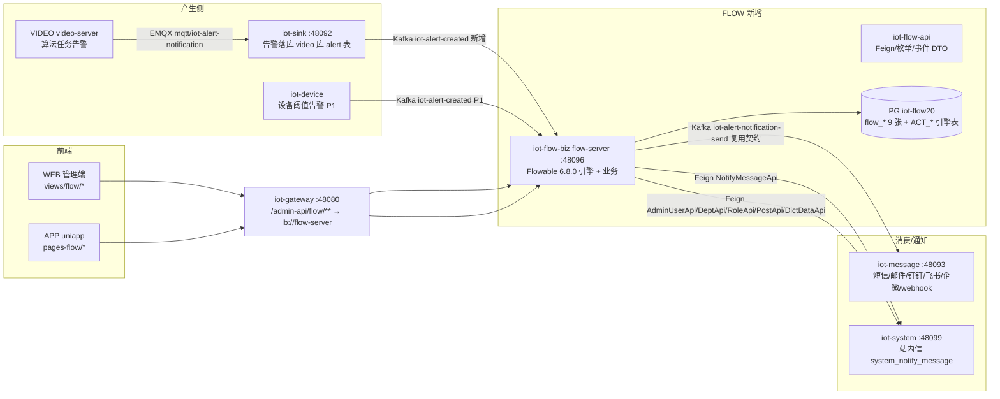
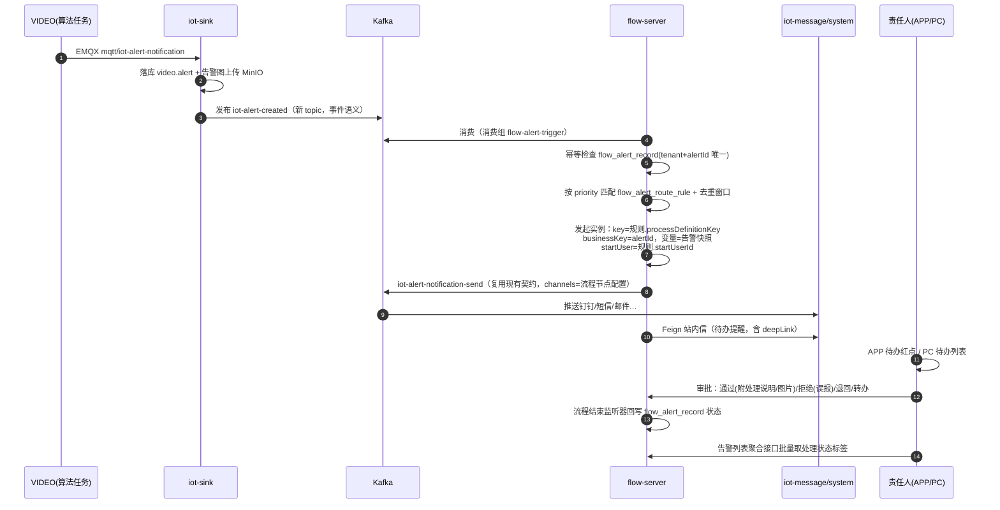
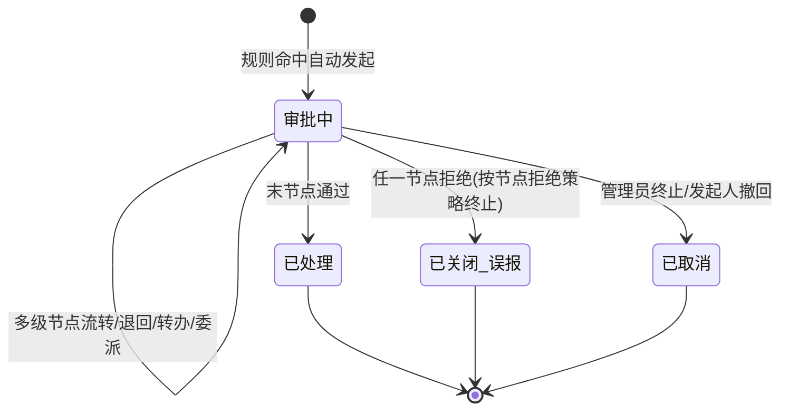

# FLOW 工作流模块（告警责任到人 + 审批 + 自定义流程）详细设计

> 状态：设计评审稿（2026-08-28）
> 参考实现：`/projects/new/yudao-cloud/yudao-module-bpm`（后端）、`/projects/yudao-ui-admin-vben/apps/web-antd`（前端；注意 `/projects/new/yudao-cloud/yudao-ui/yudao-ui-admin-vben` 仅是 README 占位，无代码）

## 1. 背景与目标

当前告警链路（VIDEO 算法任务 → EMQX → iot-sink 落库 → Kafka → iot-message 推送）只解决"通知发出去"，没有解决：

1. **责任到人**：告警发给谁、谁负责处理、处理到什么程度，无闭环记录；
2. **审批**：告警处理结果（误报/已处置/需升级）没有审核流转，也无通用审批能力；
3. **可定制**：不同告警类型（人形入侵、火焰、设备阈值越限…）需要走不同的处理流程、派给不同的人，目前写死在通知配置里。

本期新增独立微服务 **iot-flow**（FLOW），提供：

- 仿钉钉的**可视化流程设计器**（PC 端拖拽设计：审批人、条件分支、并行分支、抄送、超时处理）；
- **告警自动触发流程**：按路由规则把告警映射到流程定义，自动发起实例，businessKey=告警ID；
- **双端审批**：PC（WEB）与 APP（uniapp）共用同一套 `/admin-api/flow/**` 接口，待办/详情/审批操作全量对齐；
- **通用审批**（二期）：自定义动态表单流程，供设备维修申请、上下架审批等复用。

非目标（本期不做）：BPMN 原生设计器（仅 Simple 设计器）、流程数据报表、电子签名、多语言流程模板、跨租户流程共享。

## 2. 总体架构



设计原则：

1. **FLOW 是独立服务**，与告警产生方（iot-sink/VIDEO）仅通过 Kafka 事件 + HTTP 回调耦合，双方可独立启停（FLOW 宕机时告警照常落库推送，仅流程不触发，恢复后不追账——见 §7.4）。
2. **引擎归引擎、业务归业务**：运行态/历史态全部存 Flowable `ACT_RU_*`/`ACT_HI_*` 表，不建 `flow_process_instance`/`flow_task` 冗余表；业务状态用流程变量（`PROCESS_STATUS`/`PROCESS_REASON`）承载，完全照搬 yudao 的成熟模式。
3. **零重复建设**：用户/部门/角色/岗位/字典走 `iot-system-api` Feign；多渠道推送复用 iot-message 既有契约；鉴权复用网关 `login-user` 头透传机制；多租户复用 `iot-common-tenant`。

## 3. 技术选型与兼容性（含风险验证点）

| 项 | 选型 | 依据 |
|---|---|---|
| 流程引擎 | **Flowable 6.8.0**（`flowable-spring-boot-starter-process` + `flowable-spring-boot-starter-actuator`） | `DEVICE/iot-parent/pom.xml` 已在 dependencyManagement 预留 6.8.0 且无任何模块占用，零冲突；yudao BPM 同版本（其注释明确**不要升 6.8.1，有回退 bug**），代码可直接移植 |
| 运行时 | Spring Boot 2.7.18 + Spring Cloud 2021.0.5 + JDK 21（与全项目一致，不为 FLOW 单独升栈） | Flowable 6.8.0 官方验证到 JDK 17，**JDK 21 + PG 18 兼容性是本方案最大风险，列入 M0 首个验证任务**，见 §13 Plan B |
| 数据库 | PostgreSQL 独立库 `iot-flow20`（Flowable 官方 PG 方言支持，`database-schema-update: true` 自动建约 75 张 ACT_ 表） | 与项目"一服务一库"约定一致 |
| 注册/配置 | Nacos，服务名 `flow-server`，端口 **48096** | 现有端口 48080–48095 已占 |
| 前端设计器 | **自研 Simple 设计器**（antd 组件树 + 递归节点渲染，移植自 yudao vben `simple-process-design`） | easyaiot WEB 本身是 vben 架构 + ant-design-vue 4.x，移植成本最低；不引入 vue-flow/bpmn-js |
| 动态表单（P1） | `@form-create/ant-design-vue` + `@form-create/antd-designer` | yudao 同方案；P0 告警流程用"业务表单"模式，不依赖它 |

**M0 必验项**（不通过则走 Plan B）：
1. Flowable 6.8.0 在 JDK 21 上完成 `database-schema-update` 全量建表 + 部署一个含排他网关/多实例会签的示例流程并跑通；
2. PG 18 下 `ACT_GE_PROPERTY` 等表读写正常（重点关注 `bytea` 存储 GE_BYTEARRAY）；
3. Boot 2.7 的 `spring-boot-starter-web` 与 flowable starter 的 `applicationTaskExecutor` 共存（yudao 有现成 workaround，见其 `BpmFlowableConfiguration`）。

**Plan B**（仅当 M0 失败）：放弃 Flowable，以 Simple 设计器 JSON 为唯一模型，自研轻量审批状态机（节点类型子集：审批/抄送/条件分支/并行会签/超时），`flow_process_instance`/`flow_task` 落 PG。文档末尾 §13 给出该方案的表设计，工作量约 +8 人天，功能上限降低（无 BPMN 生态、无退回任意节点）。

## 4. 领域模型与数据库设计

### 4.1 表清单（PG 库 iot-flow20，前缀 `flow_`，共 9 张业务表 + Flowable 自动建表）

| 表 | 对应 yudao | 用途 | 期 |
|---|---|---|---|
| `flow_process_definition_info` | bpm_process_definition_info | ACT_RE_PROCDEF 扩展表：表单配置、simpleModel JSON 快照、可见范围、标题/摘要规则、自动通过策略 | P0 |
| `flow_category` | bpm_category | 流程分类 | P0 |
| `flow_user_group` | bpm_user_group | 用户组（候选组策略） | P0 |
| `flow_process_instance_copy` | bpm_process_instance_copy | 抄送记录 | P0 |
| `flow_alert_route_rule` | **新增** | 告警→流程路由规则 | P0 |
| `flow_alert_record` | **新增** | 告警↔流程实例关联 + 处理状态（责任闭环主表） | P0 |
| `flow_form` | bpm_form | 动态表单（form-create JSON） | P1 |
| `flow_process_expression` | bpm_process_expression | 条件表达式管理 | P1 |
| `flow_process_listener` | bpm_process_listener | 流程/任务监听器管理 | P2 |

刻意**不做**的表：模型（存 Flowable `ACT_RE_MODEL`）、实例/任务（存 `ACT_RU_`/`ACT_HI_`）、菜单/用户/角色（system 库）。

### 4.2 核心 DDL（PG 语法，完整脚本落 `iot-flow-biz/src/main/resources/sql/iot-flow10.sql` 并同步 `.scripts/postgresql/`）

```sql
-- 告警→流程 路由规则
CREATE TABLE flow_alert_route_rule (
    id                       BIGSERIAL PRIMARY KEY,
    rule_name                VARCHAR(64)  NOT NULL,
    priority                 INT          NOT NULL DEFAULT 0,   -- 越大越先匹配，命中即止
    process_definition_key   VARCHAR(64)  NOT NULL,             -- 命中后发起的流程模型 key
    match_conditions         JSONB        NOT NULL DEFAULT '[]',-- [{"field":"taskType","op":"EQ","value":"intrusion"},...]
    dedup_window_seconds     INT          NOT NULL DEFAULT 0,   -- 同 device+task+event 去重窗口，0=不去重
    enabled                  BOOLEAN      NOT NULL DEFAULT TRUE,
    start_user_id            BIGINT       NOT NULL DEFAULT 1,   -- 系统代发起人
    remark                   VARCHAR(255),
    -- BaseDO 标准字段
    creator                  VARCHAR(64)  DEFAULT '',
    create_time              TIMESTAMP    NOT NULL DEFAULT CURRENT_TIMESTAMP,
    updater                  VARCHAR(64)  DEFAULT '',
    update_time              TIMESTAMP    NOT NULL DEFAULT CURRENT_TIMESTAMP,
    deleted                  BOOLEAN      NOT NULL DEFAULT FALSE,
    tenant_id                BIGINT       NOT NULL DEFAULT 0
);
CREATE INDEX idx_farr_enabled_priority ON flow_alert_route_rule (tenant_id, enabled, priority DESC);

-- 告警处理记录（责任闭环主表；alert_id 唯一约束 = Kafka 重复消费幂等）
CREATE TABLE flow_alert_record (
    id                       BIGSERIAL PRIMARY KEY,
    alert_id                 BIGINT       NOT NULL,             -- video 库 public.alert.id
    alert_source             VARCHAR(32)  NOT NULL DEFAULT 'VIDEO_TASK', -- VIDEO_TASK / DEVICE_THRESHOLD
    alert_snapshot           JSONB,                             -- 告警字段快照，防 video 侧清理后失联
    process_instance_id      VARCHAR(64),
    process_definition_key   VARCHAR(64),
    process_instance_status  INT          NOT NULL DEFAULT 1,   -- 1审批中 2通过 3拒绝 4取消（对齐引擎变量）
    current_task_name        VARCHAR(128),
    current_assignees        VARCHAR(512),                      -- 当前责任人 userId 列表（缓存，供列表页免联查）
    finish_time              TIMESTAMP,
    -- BaseDO + tenant
    creator                  VARCHAR(64)  DEFAULT '',
    create_time              TIMESTAMP    NOT NULL DEFAULT CURRENT_TIMESTAMP,
    updater                  VARCHAR(64)  DEFAULT '',
    update_time              TIMESTAMP    NOT NULL DEFAULT CURRENT_TIMESTAMP,
    deleted                  BOOLEAN      NOT NULL DEFAULT FALSE,
    tenant_id                BIGINT       NOT NULL DEFAULT 0,
    CONSTRAINT uk_far_alert UNIQUE (tenant_id, alert_id)
);
CREATE INDEX idx_far_status ON flow_alert_record (tenant_id, process_instance_status, create_time DESC);
CREATE INDEX idx_far_assignees ON flow_alert_record (tenant_id, current_assignees); -- "我负责的告警"查询
```

`flow_process_definition_info` 关键列照抄 yudao：`model_id`、`process_definition_id`、`form_type`(NORMAL/CUSTOM)、`form_conf`、`form_fields`、`simple_model`(JSONB)、`title_rule`、`summary_rule`、`start_user_ids`(JSONB 可发起人)、`manager_ids`(JSONB 流程管理员)、`auto_approve_type`。

### 4.3 字典（system_dict_type 新增，随 SQL 脚本交付）

`flow_model_type`(10 SIMPLE/20 BPMN 占位)、`flow_model_form_type`(10 动态表单/20 业务表单)、`flow_task_status`(-2跳过/0待审批/1审批中/2通过/3拒绝/4取消/5退回/7审批中-多实例)、`flow_process_instance_status`、`flow_task_candidate_strategy`、`flow_alert_record_status`、`flow_approve_method`(1随机/2会签比例/3或签/4依次)。

## 5. 核心流程设计

### 5.1 告警责任闭环主链路



**路由匹配语义**：`match_conditions` 数组内 AND，数组间无 OR（多规则靠 priority 表达）；`op` 支持 `EQ/NE/IN/PREFIX/REGEX`，`field` 取告警快照字段（`object/event/taskType/taskId/taskName/deviceId/deviceName/nodeId/edgeNodeId`）。**P1** 扩展设备阈值告警时增加 `alertSource=DEVICE_THRESHOLD` 维度。

**流程变量注入**（供条件分支与表单展示）：`alertId`、`alertObject`、`alertEvent`、`alertTime`、`taskName`、`taskId`、`taskType`、`deviceId`、`deviceName`、`imageUrl`、`recordPath`、`correlationId`，加引擎标准变量 `PROCESS_STATUS`、`PROCESS_START_USER_ID`。

**实例标题规则**（内置默认，可在定义扩展表覆盖）：`【告警处理】{taskName}-{alertEvent}-{yyyy-MM-dd HH:mm}`；摘要：告警图 + 事件描述。

### 5.2 告警状态机（flow_alert_record 视角）



内置预置模型 `alarm-handle`（随 SQL 初始化为不可删除的内置模板，默认停用，用户复制后定制）：**责任人处理**（候选策略=用户组"安防处理组"示例，或签）→ **抄送安全主管** → **主管审核**（会签，超时 2h 提醒/24h 自动通过）。节点"拒绝即终止"对应误报语义。

### 5.3 存量告警补触发

告警页对未进流程的历史告警提供手动入口：`POST /admin-api/flow/alert-record/trigger`（body: `alertId + processDefinitionKey`），走同一发起 service（与 Kafka 消费共用，保证幂等与状态一致）。

## 6. 后端模块设计（DEVICE/iot-flow）

### 6.1 工程骨架

```
DEVICE/iot-flow/
├── iot-flow-api/                    # 供其他服务依赖：Feign + 枚举 + 事件
│   └── com.basiclab.iot.flow
│       ├── api/                     # FlowProcessInstanceApi(@FeignClient("flow-server"))
│       ├── dto/                     # AlertCreatedMessage、ProcessInstanceCreateReqDTO…
│       ├── enums/                   # 流程实例状态/任务状态/候选策略/节点类型…
│       └── event/                   # FlowProcessInstanceStatusEvent(见 6.5)
└── iot-flow-biz/                    # flow-server :48096
    └── com.basiclab.iot.flow
        ├── controller/admin/{model,definition,task,alert,userGroup,category}/  # + vo/
        ├── service/{model,definition,task,alert,message,candidate}/
        ├── dal/dataobject/… + dal/pgsql/…
        ├── framework/flowable/      # 引擎定制层（移植自 yudao，见 6.2）
        ├── framework/kafka/         # 告警事件消费者、通知消息生产者
        └── FrameworkConfiguration / FlowServerApplication
```

配置文件五件套（application/application-{local,dev,prod}/bootstrap/bootstrap-{local,dev,prod}）照抄 iot-visualize；`application.yaml` 中 flowable 段：`flowable.database-schema-update: true`、`check-process-definitions: false`、`history-level: audit`。

**部署接线清单**（实施时逐项打勾）：
1. `DEVICE/pom.xml`：`<module>iot-flow</module>` + dependencyManagement 加 `iot-flow-api`；
2. `iot-gateway/src/main/resources/application.yaml`：路由 `id=flow, uri=lb://flow-server, predicates=[Path=/admin-api/flow/**]` + knife4j 聚合段；
3. `DEVICE/docker-compose.yml`：flow-server 服务段（依赖 nacos/postgres）；
4. `.scripts/postgresql/`：新增 `iot-flow10.sql`（业务表 DDL + 内置模型/字典/菜单初始化），`00-init-databases.sh` 登记建库；
5. iot-sink：`IotAlgoBusMqttHandler` 告警落库后追加发布 Kafka `iot-alert-created`（约 10 行，独立小 PR）。

### 6.2 从 yudao 移植的核心类映射表（移植时保留包结构，前缀 Bpm→Flow）

| yudao 类（bpm-server） | 落位 iot-flow-biz | 改造点 |
|---|---|---|
| `framework/flowable/config/BpmFlowableConfiguration` | `framework/flowable/config/FlowFlowableConfiguration` | 原样（含 applicationTaskExecutor workaround） |
| `framework/web/core/FlowableWebFilter` | 同名 | 原样（userId 写入 Flowable Authentication） |
| `framework/flowable/core/util/FlowableUtils` | 同名 | 原样（租户 Long↔String 桥接、监听器租户还原） |
| `core/behavior/BpmActivityBehaviorFactory` + `BpmUserTaskActivityBehavior` + 两个多实例 Behavior | 同构改名 | 原样（候选人策略挂接点） |
| `core/candidate/*`（接口 + Invoker + 16 策略） | 同构 | **策略子集先行**（见 6.3），其余策略类按需补 |
| `core/util/BpmnModelUtils` / `SimpleModelUtils` | 同名改前缀 | 原样（Simple JSON→BPMN + BpmnAutoLayout） |
| `core/enums/BpmnModelConstants` / `BpmnVariableConstants` | 同名改前缀 | 原样（BPMN 扩展属性命名空间） |
| `core/listener/BpmProcessInstanceEventListener` / `BpmTaskEventListener` / `BpmCopyTaskDelegate` | 同构改名 | 原样 |
| `core/event/BpmProcessInstanceEventPublisher` + api 包 `StatusEvent(StatusEventListener)` | 同构改名 | 见 6.5 |
| `service/task/BpmProcessInstanceServiceImpl`(1070行) / `BpmTaskServiceImpl`(1717行) / `BpmModelServiceImpl` / `BpmProcessDefinitionServiceImpl` / `BpmMessageServiceImpl` | 同构改名 | ①`SmsSendApi` 换成本地 `FlowMessageService`（§8）；②标题/摘要规则保留 |
| `dal/dataobject/definition/BpmProcessDefinitionInfoDO` 等 8 DO | `dal/dataobject/{definition,task,alert}/` | 表名 bpm_→flow_；`simple_model` 改 JSONB |
| `service/oa/*`（OA Leave 范式） | **不移植**，由 `service/alert/` 取代 | flow_alert_record 即业务单据 |

移植注意（yudao 代码里的坑，原样保留）：`approveTask/rejectTask` 内部经 `getSelf()`（SpringUtil 代理）保证事务切面生效；自动通过/通知依赖 `TransactionSynchronizationManager.afterCompletion`；多实例或签/会签计数逻辑在 `approveAfterSignTask`。

### 6.3 候选人策略（责任到人的配置面）

P0 落地 10 种（覆盖告警场景全部用法），接口与 Invoker 机制照搬 yudao `BpmTaskCandidateStrategy` + `BpmTaskCandidateInvoker`：

| 枚举值 | 策略 | 告警场景用法 |
|---|---|---|
| 30 USER | 指定成员 | 固定责任人（如当班安全员） |
| 40 USER_GROUP | 用户组 | 「安防处理组」轮值（组内或签） |
| 10 ROLE | 角色 | 「安全主管」角色审核 |
| 20 DEPT_MEMBER / 21 DEPT_LEADER | 部门成员/负责人 | 按设备所属部门派单 |
| 22 POST | 岗位 | 值班岗 |
| 36 START_USER / 37 START_USER_DEPT_LEADER | 发起人/其部门负责人 | 通用审批用（告警流发起人是系统，少用） |
| 34 APPROVE_USER_SELECT / 35 START_USER_SELECT | 审批人自选/发起人自选 | 手动发起的告警处理时临时指派 |
| 1 ASSIGN_EMPTY | 审批人为空兜底 | 配自动通过/自动拒绝/转管理员 |
| 60 EXPRESSION | 表达式 | P1 |
| 50/51 FORM_USER/FORM_DEPT_LEADER、23 连续多级负责人、38、51… | P1 按需补 | — |

运行时统一在 `calculateUsersByTask` 内做「移除禁用用户 → 空则走 ASSIGN_EMPTY → 按配置剔除发起人」。

### 6.4 任务动作集（P0 全量）

通过(approve)/拒绝(reject)/退回到任意历史节点(return)/委派(delegate)/转办(transfer)/加签减签(sign create+delete)/抄送(copy)/撤回(withdraw)；超时处理（审批节点 Boundary Timer：提醒/自动通过/自动拒绝 + maxRemindCount）；审批人为空与自动通过/拒绝节点；或签/会签(比例)/依次审批。均来自 yudao `BpmTaskServiceImpl`，不自研。

### 6.5 审批结果对外发布

引擎实例结束 → `FlowProcessInstanceEventPublisher` 发 Spring 应用事件 `FlowProcessInstanceStatusEvent(processInstanceId, processDefinitionKey, businessKey, status, reason)`：

- 模块内：`FlowAlertStatusListener`（`getProcessDefinitionKey()` 按 `alarm-*` 前缀过滤或按 modelKey 精确匹配）回写 `flow_alert_record`；
- 跨服务（P1 需要时）：复用项目既有 Kafka messagebus 模式发 `flow-instance-finished` topic，或由消费方 Feign 回查；**P0 不做跨服务广播**，告警闭环全部收敛在 flow-server 内。

## 7. 集成契约

### 7.1 Kafka：iot-sink → flow（新增 topic `iot-alert-created`）

```json
{
  "alertId": 12345,
  "alertSource": "VIDEO_TASK",
  "object": "person", "event": "intrusion", "information": "检测到人形入侵",
  "time": "2026-08-28T10:00:00+08:00",
  "deviceId": "dev-001", "deviceName": "东门摄像头",
  "taskType": "realtime", "taskId": "t-88", "taskName": "周界入侵检测",
  "imageUrl": "http://.../alert/xxx.jpg", "recordPath": "...",
  "correlationId": "c-20260828-001", "nodeId": "...", "edgeNodeId": "...",
  "tenantId": 1
}
```

生产侧：`IotAlgoBusMqttHandler` 处理告警落库成功后发送（`alert` 表全字段映射，字段名与 `AlertDO` 对齐）；消费侧：`@KafkaListener(topics="iot-alert-created", groupId="flow-alert-trigger")`。**语义为 at-least-once，消费侧靠 `uk_far_alert` 唯一约束幂等**，重复消息直接忽略并记 debug 日志。

### 7.2 Kafka：flow → iot-message（复用现有 topic `iot-alert-notification-send`）

待办/结果通知直接按 `AlertNotificationMessage` 既有契约发送（notifyUsers=候选人，templateParams 携带流程标题/摘要/待办链接），iot-message **零改动**即可发钉钉/短信/邮件/webhook。若后续要区分流程通知模板，再加 `flow-notification-send` topic 并在 iot-message 增加 Listener（小改动，P2）。

### 7.3 Feign 依赖清单（`@EnableFeignClients`，全部来自 iot-system-api）

`AdminUserApi`（用户昵称/头像、有效性校验）、`DeptApi`（部门及负责人，部门负责人策略依赖）、`PostApi`、`RoleApi`、`PermissionApi`（用户→角色）、`DictDataApi`、`NotifyMessageApi`（站内信）。服务内转发 `login-user` 头的 `RequestInterceptor` 照抄现有模块。

### 7.4 可用性语义

FLOW 宕机期间：告警照常落库/推送（现有链路不受影响），仅流程不触发；恢复后**不追账**（Kafka 默认 retention 内的消息若消费组未提交会补消费，因此实际是"尽量补"）；对必须补建流程的场景走 §5.3 手动触发。规则表变更（启停/优先级）实时生效，无需重启。

## 8. 消息通知设计

| 触点 | 渠道 | 实现 |
|---|---|---|
| 任务创建（待办） | 站内信 | Feign `NotifyMessageApi`，模板 `flow_task_assigned`，参数：流程名/节点名/发起源/跳转参数 |
| 任务创建（待办） | 钉钉/短信/邮件/webhook | Kafka `iot-alert-notification-send`（节点或全局配置 channels） |
| 任务超时 | 同上 | REMINDER 策略，maxRemindCount 限次 |
| 流程通过/拒绝 | 站内信 + 多渠道 | 模板 `flow_process_instance_approve/reject` |
| 抄送 | 站内信 | 模板 `flow_task_cc` |

站内信 deepLink 约定：`flow://instance/{processInstanceId}?taskId={taskId}`，PC 端消息中心解析后跳 `/flow/process-instance/detail?id=&taskId=`；APP 端解析后跳 `pages-flow/detail/index`。**APP 离线推送（unipush）列为 P2 可选项**——本期 APP 提醒依赖站内信红点 + 打开应用后的待办角标轮询（30s 间隔 `GET /flow/task/todo-count`，返回未读数）。

## 9. REST API 设计（controller 路径不含 `/admin-api` 前缀，由网关拼合；APP 与 PC 共用同一组接口，APP 登录即 ADMIN userType 走 `/admin-api`）

| 基路径 | 端点 | 说明 |
|---|---|---|
| `/flow/model` | list/get/create/update/update-bpmn(保留)/deploy/update-state/delete/simple-get/simple-update | 模型管理（Simple 设计器读写走 simple/*） |
| `/flow/process-definition` | page/list/get/simple-list | 定义查询 |
| `/flow/category` `/flow/user-group` | 标准 CRUD + simple-list | 定义辅助 |
| `/flow/process-instance` | create/my-page/manager-page/get/cancel-by-start-user/cancel-by-admin/**get-approval-detail**/**get-bpmn-model-view**(返回 simpleModel+高亮节点)/get-next-approval-nodes | 发起与实例 |
| `/flow/process-instance/copy` | page | 抄送我的 |
| `/flow/task` | todo-page/done-page/manager-page/**todo-count**/approve/reject/return/delegate/transfer/create-sign/delete-sign/copy/withdraw/list-by-process-instance-id/list-by-return | 审批中心 |
| `/flow/alert-route-rule` | list/page/create/update/update-enabled/delete/preview-match(传告警样例试匹配) | 路由规则 |
| `/flow/alert-record` | page/my-page(**我负责的告警**：按 currentAssignees)/list-by-alert-ids(批量，供告警列表聚合)/trigger(手动发起)/get | 告警闭环 |

权限码 `flow:model:query` / `flow:model:deploy` / `flow:process-instance:manager-query` / `flow:task:approve` / `flow:alert-route-rule:*` / `flow:alert-record:query`…（controller 上按项目惯例写 `@PreAuthorize("@ss.hasPermission(...)")`，当前全局权限开关关闭不影响后续启用）。

VO 命名照项目约定：`XxxPageReqVO/XxxRespVO/XxxSaveReqVO`；响应 `CommonResult` / `PageResult`。

## 10. PC 前端设计（WEB/src）

WEB 为 vben 架构 + ant-design-vue 4.x + 后端动态菜单（BACK 模式），**已存在 `src/api/bpm/` 遗留目录**（yudao 约定，无对应页面）。处理：新建 `src/api/flow/`（从 vben `apps/web-antd/src/api/bpm/` 移植改路径），`src/api/bpm/` 目录本次移除避免误导。

```
src/api/flow/{model,definition,processInstance,task,category,userGroup,alertRouteRule,alertRecord}.ts
src/views/flow/
├── model/
│   ├── index.vue                    # 模型卡片列表（分类分组、部署/停启用/删除，useSortable 拖拽排序）
│   ├── form/index.vue               # 四步向导：基本信息→表单(P0仅业务表单:告警只读)→流程设计→更多设置
│   ├── form/modules/{basic-info,process-design,extra-setting}.vue
│   └── definition/index.vue         # 已部署定义/版本
├── components/simple-process-design/ # 设计器（整体移植 vben 同名目录，antd 组件，无画布库依赖）
│   ├── simple-process-designer.vue / simple-process-model.vue / process-node-tree.vue
│   ├── nodes/…（11 种节点组件）
│   ├── nodes-config/…（节点属性抽屉：审批人策略/多人方式/超时/为空/表单权限/条件组…）
│   └── simple-process-viewer.vue     # 详情页只读渲染 + 递归染色
├── processInstance/
│   ├── index.vue（我的流程）/ manager/index.vue（全部实例）
│   └── detail/                      # 审批详情核心页（同一页面复用：待办审批/我的查看/抄送查看）
│       ├── index.vue                # get-approval-detail 一次取全量
│       └── modules/{time-line,operation-button,task-list}.vue
├── task/{todo,done,copy}/index.vue  # 待办/已办/抄送
├── alert/index.vue                  # 告警处理记录（路由规则管理 + 记录列表双 Tab）
├── category/index.vue
└── group/index.vue
```

> **入口收敛（2026-08-28 变更）**：模块改名为「告警工单」，不再作为独立侧边栏顶级菜单。
> `flow_menu.sql` 中顶级目录（3300）`visible=false`，所有子菜单/按钮权限行保留（路由仍注册，`v-auth` 依赖不变）：
> - WEB 入口收敛为【告警管理 → 告警工单】Tab（`views/alert/index.vue` 新增 `AlarmTicket` 组件，
>   白底纯列表风格与模型管理一致；工单列表 / 我的待办 / 已办任务 / 流程实例 / 路由规则 / 流程模型 六个子 Tab）；
> - 隐藏路由不受影响：流程设计 `/flow/model/design/:id`、审批详情 `/flow/process-instance/detail`
>   （站内信/APP deepLink `flow://instance/{id}?taskId=` 仍可直达）；
> - mini/edge 部署形态不部署 iot-flow，`isFlowTicketEnabled()` 隐藏该 Tab。

页面清单对应菜单（`system_menu` 初始化 SQL）：

| 菜单 | 组件路径 | 权限码示例 |
|---|---|---|
| 告警工单（原工作流，目录，visible=false） | — | — |
| ├ 流程模型 | flow/model/index | flow:model:* |
| ├ 流程定义 | flow/model/definition/index | flow:process-definition:query |
| ├ 我的流程 | flow/processInstance/index | flow:process-instance:query |
| ├ 待办/已办/抄送 | flow/task/{todo,done,copy}/index | flow:task:query |
| ├ 告警处理 | flow/alert/index | flow:alert-record:query |
| ├ 流程分类 / 用户组 | flow/category/index、flow/group/index | — |

交互要点：
1. **审批详情页**：时间线组件（任务状态→图标/颜色映射表）+ Simple 查看器高亮（`finished/unfinished/rejected` 三色，数据来自 `get-bpmn-model-view`）+ 操作按钮条（通过/拒绝/退回/委派/转办/加签/抄送，全部带理由弹窗）+ 审批人自选回填；告警流程在详情顶部追加"告警信息卡"（快照图、设备、时间，复用 `utils/alertMinioImage.ts` 取图鉴权逻辑）。
2. **告警列表页联动**：`views/alert/index.vue` 的表格列与卡片各加"处理状态"标签，挂载时批量调 `list-by-alert-ids`；行操作新增"发起处理"（存量告警补触发）。轻改，不动现有查询逻辑。
3. 顶部导航加"待办"红点：轮询 `todo-count`（与告警轮询共用节流器）。
4. 设计器节点类型 P0 放开：发起人/审批人/抄送/条件分支/并行分支/延迟器/触发器占位禁用（触发器、子流程、路由分支 P2）。

## 11. APP 端设计（APP/src）

APP 为 unibest(uniapp Vue3) + wot-design-uni + z-paging，登录即 ADMIN 用户、走 `/admin-api`，**双端同接口天然打通**；无 webview、无推送、无扫码（均不依赖）。

```
src/api/flow/{task,processInstance,alertRecord}.ts        # 复用 PC 同路径接口
src/pages-flow/                                            # 新分包（pages.config.ts 自动收集）
├── todo/index.vue         # 待办列表：z-paging + wd-tabs(待办/已办/抄送) + 角标
├── detail/index.vue       # 审批详情：告警信息卡(大图预览) + 简化时间线(wd-steps 风格) + 底部操作条(通过/拒绝/退回,理由弹窗)
├── copy/index.vue         # 抄送我的（P1，可与 todo 合页）
└── create/index.vue       # 发起（P1 通用审批）
```

联动改造：
1. `pages/message/`（站内信）列表项解析 deepLink `flow://instance/...` → 跳 `pages-flow/detail`（登录拦截器已覆盖分包路由）；
2. tabbar「告警」页：列表项加处理状态角标 + 顶部状态筛选（接 `list-by-alert-ids` 聚合），告警详情弹窗加"处理进度"入口；
3. 首页工作台加「待办审批」入口卡（含角标数，`todo-count` 30s 轮询、`onShow` 刷新）；
4. 角色控制：`pages-flow` 页面在 `pages.config.ts` 不设强制登录豁免，走全局登录拦截；tabbar 角标仅对有 `flow:task:query` 权限码的用户显示（复用 `useAccess`）。

## 12. 非功能性设计

- **事务一致性**：发起流程与写 `flow_alert_record` 同一本地事务（PG 单库）；Kafka 通知在 `afterCompletion` 发送（防回滚后通知已出）；消费幂等靠唯一约束（§7.1）。
- **多租户**：业务 DO 继承 `TenantBaseDO`；引擎侧 `FlowableUtils.getTenantId()/execute()` 双向桥接（发起写入、监听器还原），照搬 yudao。
- **性能**：告警峰值按现有 EMQX 吞吐预估（千级/小时），单实例 Flowable 足够；`get-approval-detail` 已是聚合接口避免前端 N+1；`current_assignees` 冗余列避免列表页联查 ACT_ 表。
- **安全**：审批动作服务端二次校验当前登录人 ∈ 任务 candidate/assignee；`get-bpmn-model-view` 校验发起人/候选人/管理员/抄送人四类可见性（照 yudao 规则）。
- **可观测**：flow-server 接入现有 knife4j 聚合；关键链路（触发/匹配结果/发起/结束）打 info 日志含 alertId+instanceId，便于对账。

## 13. 实施计划（含工作量，1 名后端 + 1 名前端并行）

| 里程碑 | 内容 | 工作量 | 出口标准 |
|---|---|---|---|
| **M0 风险验证** | Flowable 6.8.0 + JDK21 + PG18 spike：建表、部署示例流程、会签/网关/超时跑通；产出决策（主线 or Plan B） | 1.5d | §3 三个验证项全绿 |
| **M1 后端闭环** | 模块骨架 + 6.2 移植 + 候选策略 10 种 + 任务动作集 + 路由规则 + Kafka 触发 + flow_alert_record + iot-sink 发事件 + API 联调(mock 前端) | 8d | Postman 全链路：造告警→自动建流程→审批→状态回写 |
| **M2 PC 前端** | api/flow + 设计器移植 + 四步向导 + 模型/定义页 + 待办/已办/抄送 + 审批详情(时间线/染色/操作) + 告警页联动 + 菜单 SQL | 8d | 浏览器全流程可操作；内置模型可复制定制并部署 |
| **M3 APP 端** | pages-flow 待办/详情 + 消息中心 deepLink + 告警 tab 角标/筛选 + todo-count 红点 | 4d | 真机 APP 完成一次告警审批闭环 |
| **M4 增强（P1）** | form-create 动态表单 + 通用审批（发起页）+ 表达式/表单候选人策略 + 超时自动处理调优 + 抄送中心 APP | 6d | 非告警类自定义流程可设计可审批 |
| **P2 备选池** | unipush 离线推送、bpmn-js 设计器、触发器/子流程节点、HTTP 回调 video 回写 business_tags、流程报表、监听器管理 | 按需 | — |

## 14. 关键决策记录（评审重点确认）

1. **引擎版本锁 Flowable 6.8.0**（不升 6.8.1/7.x）：6.8.1 有回退 bug；7.x 需 Spring Boot 3，与全项目 2.7.18 冲突。JDK21 兼容性由 M0 兜底。
2. **告警触发用新 topic `iot-alert-created` 而非复用 `iot-alert-notification-send`**：事件与指令语义分离；告警未配置通知渠道时流程仍应触发。代价是 iot-sink 约 10 行改动（独立 PR，可灰度）。
3. **不建 flow_process_instance/flow_task 表**：状态以流程变量承载，完全复用 yudao 成熟模式，避免双写不一致。
4. **APP 与 PC 共用 `/admin-api/flow` 接口**：easyaiot 的 APP 登录就是 ADMIN userType（现状即走 /admin-api），不做 `/app-api` 双份接口；未来若引入 C 端会员审批，再加 app-api 薄层。
5. **设计器只做 Simple（仿钉钉）**：目标用户是安防/运维人员，BPMN 学习成本不可接受；bpmn-js 留 P2 且非必须。
6. **FLOW 宕机不阻断告警主链路**：触发是尽力而为 + 手动补触发兜底，符合"告警通知是主路径、流程闭环是增强"的产品定位。
7. **前端 API 目录收敛为 `api/flow`**，移除遗留 `api/bpm/` 空壳，避免双约定并存。
8. **入口收敛为「告警管理 → 告警工单」Tab**：原「工作流」顶级菜单（visible=true）改为「告警工单」且 `visible=false`，菜单/按钮权限行全保留（路由注册与 `v-auth` 不受影响）；WEB 侧新 Tab 走白底纯列表（BasicTable，无卡片），与模型管理风格一致。deepLink（站内信/APP 跳审批详情）与流程设计器跳转均不受影响。

---

### 附2：Demo 数据一键部署（.scripts/flow/）

演示/验收环境的初始化物料，均已幂等化，可重复执行：

| 文件 | 目标库 | 内容 |
|---|---|---|
| `.scripts/flow/patches/flow_menu.sql` | ruoyi-vue-pro20 | WEB 管理端菜单（ID 段 3300-3399） |
| `.scripts/flow/patches/flow_notify_template.sql` | ruoyi-vue-pro20 | 待办提醒模板 `flow_task_todo`（id=1001，含 deepLink 占位符） |
| `.scripts/flow/patches/flow_demo_seed.sql` | iot-flow20 | 烟感火情会签模型 `alert_fire_smoke`（ACT_RE_MODEL/DEPLOYMENT/PROCDEF/BYTEARRAY 全套引擎工件，版本 3：初审 → 主管会签 admin+测试号，拒绝退回初审）+ 路由规则「烟感火情路由」（priority 20，taskName EQ 烟感火情识别） |
| `.scripts/flow/flow_demo_replay.sh` | — | 一键重放：应用种子 SQL → 向 `iot-alert-created` 发 8 条真实形状告警（#40001-#40008）→ 以 admin 走管理端 API 驱动出 通过/拒绝/取消/退回/会签半审/抄送 全状态 |

用法：

```bash
bash .scripts/flow/flow_demo_replay.sh             # 菜单/模板/种子 + 8 条实例全状态（幂等，已有告警自动跳过）
bash .scripts/flow/flow_demo_replay.sh --seed-only # 仅 SQL 初始化，不造实例
```
一键部署：所有 OS 安装器均已在部署完成后自动执行上述脚本（`ensure_flow_demo_after_stack` 钩子，等待网关与 flow-server 就绪后重放）：

| 安装器 | 平台 | 接入方式 |
|---|---|---|
| `.scripts/docker/install_linux.sh` | Linux x86_64 | 直接挂钩（4 个 after_stack 出口） |
| `.scripts/docker/install_linux_arm.sh` | Linux ARM64 | 直接挂钩（4 个出口） |
| `.scripts/docker/install_linux_kylin.sh` | 麒麟 V10 | 直接挂钩（4 个出口） |
| `.scripts/docker/install_linux_centos.sh` / `_centos_arm.sh` / `_openeuler.sh` | CentOS / openEuler | 转交上述主脚本，自动继承 |
| `.scripts/docker/install_mac.sh` / `install_windows.sh` | macOS / Windows(Git Bash) | source `install_desktop_common.sh`，已挂钩（start/update 完成后） |
| `.scripts/docker/install_windows.ps1` | Windows PowerShell | 委托 `install_windows.sh`，自动继承 |
| `install_middleware_*` / `install_business_linux.sh` | 仅中间件 / 仅业务模块 | 不适用（FLOW 随整栈初始化） |

关闭开关：`EASYAIOT_ENABLE_FLOW_DEMO=0`；iot-flow 服务本身在 mini/standard/full profile 均默认运行（仅 edge 纯网关形态无 Kafka，钩子会快速跳过并告警）。

说明：
- 实例数据（flow_alert_record/ACT_ 运行时与历史/抄送/站内信）**不落 SQL**——运行时状态含变量 blob 与历史树，纯 SQL 重建不可靠，统一走 Kafka 重放 + API 驱动生成；
- 引擎有流程定义缓存：在 flow-server 已运行的环境手工执行 seed SQL 后需 `docker compose restart iot-flow`；一键部署（先建库后启动）无需；
- 告警截图 `demo-alert-*.png` 随 APP 源码提交（`APP/src/static/images/`），Kafka 快照中的 imagePath 指向 APP dev server。

---

### 附：Plan B 表设计（仅 M0 失败时启用）

自研状态机方案核心表：`flow_process_instance`（id/model_id/simple_model_snapshot/current_node_key/status/start_user_id/business_key）、`flow_task`（instance_id/node_key/node_name/candidate_json/assignee/status/reason/sign_parent_id）、`flow_model`（替代 ACT_RE_MODEL 存 Simple JSON + 版本号 + 状态）。执行器按 JSON 树解释执行（顺序/条件/并行/会签/超时），候选人策略与通知层与本方案共用。放弃能力：退回任意节点（简化为退上一节点）、历史树查询（简化为任务列表）、与 BPMN 生态互通。
