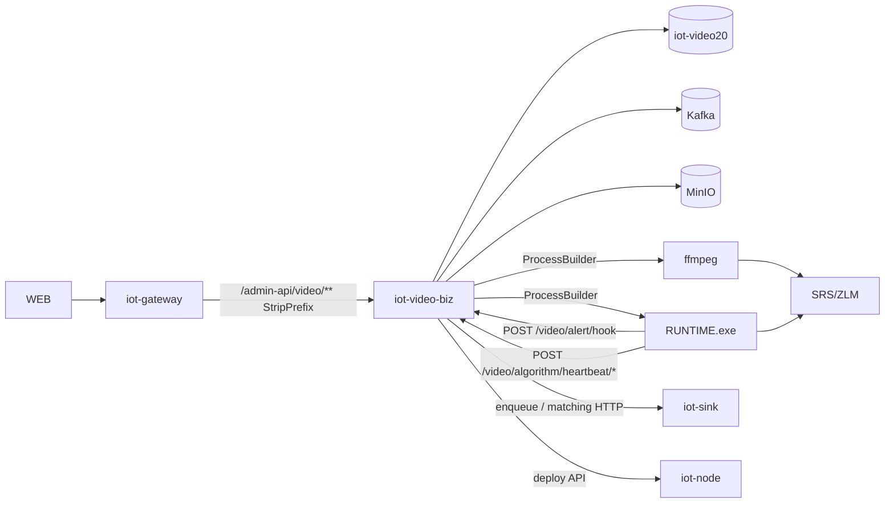

# VIDEO Java — 技术栈与整体结构（核心设计报告）

> **状态：** 规划稿，待审查通过后进入 Phase 0。  
> **Oracle 基线：** 本地 `main` @ `4f93baf`（`F:/acme`；Python VIDEO 为真相源）。  
> **原则：** 只替换 Python VIDEO 编排层；RUNTIME / ffmpeg / SRS / ZLM / AI / iot-sink 匹配链保持调用关系。

---

## 1. 技术栈选型（开题锁定）

### 1.1 推荐栈（唯一主路径）

| 层 | 选型 | 版本锚点 | 理由 |
|----|------|----------|------|
| 语言 | **Java 21** | 与 `DEVICE/iot-parent` 一致 | 现有全家桶已是 21；禁止另开 Java 17「孤岛」 |
| 构建 | **Maven** 多模块 | `DEVICE/pom.xml` 注册 | 禁止 Gradle 分叉 |
| 应用框架 | **Spring Boot** | **2.7.18** | 与 DEVICE BOM 对齐；不抢先升 Boot 3 |
| 微服务 | **Spring Cloud** | **2021.0.5** | 同 BOM |
| 注册/配置 | **Spring Cloud Alibaba Nacos** | **2021.0.4.0** | 现网 `video-server` 已走 Nacos |
| Web | Spring MVC + `iot-common-web` | — | 契约 JSON 与 `CommonResult` 风格对齐 gateway/sink |
| ORM | **MyBatis-Plus** via `iot-common-mybatis` | BOM | VIDEO 表已在 `iot-video20`；禁止 JPA 双轨 |
| 连接池 | HikariCP（Boot 默认） | — | — |
| Redis | Spring Data Redis + **Redisson 3.18.0** | BOM | 与 sink/system 一致 |
| Kafka | `spring-kafka` / `iot-common-mq` | BOM | 主题名与 Python VIDEO / iot-sink **字节级对齐** |
| MinIO | 现有 MinIO Java SDK 模式（参考 `iot-file` / `iot-sink`） | 与现网一致 | 不换对象存储 |
| HTTP 出站 | Spring `RestTemplate`/`WebClient` + 现有 Feign 习惯 | — | 调 sink/gateway/auth |
| 进程编排 | **`ProcessBuilder`** + 自研 `ProcessSupervisor` | — | 对齐 Python `AlgorithmTaskDaemon` / `FFmpegDaemon` |
| 调度 | Spring `@Scheduled` / 可选 Quartz | — | 对齐健康恢复、空间清理 |
| ONVIF（P1+） | 成熟 Java ONVIF/SOAP 库（如 onvif-java 一类，Phase 1 再钉死坐标） | — | **机制调用**，不自研协议栈 |
| 人脸/车牌重推理（P1+） | **ONNX Runtime Java** 跑现有 `.onnx`，或阶段性 HTTP 旁路到既有实现 | — | 禁止「另起业务程序冒充完成」且不进门禁 |
| 测试 | JUnit 5、MockMvc、WireMock、Testcontainers（PG/Kafka 按需） | — | 与 certify 脚本分工：单测 vs 双边等价 |
| 可观测 | Micrometer + Spring Actuator | — | `/actuator/health` 对标 Flask |

**明确不选（及原因）：**

| 候选 | 为何否决 |
|------|----------|
| 升 Spring Boot 3 / Jakarta 一并做 | 与 DEVICE 全家桶分裂，合入成本高于 VIDEO 迁移本身 |
| Quarkus / Micronaut / Vert.x | 生态与 iot-* 客户端、Nacos、网关约定不兼容 |
| 用 WebFlux 全异步重写 | 进程编排与阻塞 IO（ffmpeg pipe、文件）为主；无收益 |
| 把 RUNTIME 嵌进 JVM（JNI 全量） | 越界；RUNTIME 保持独立进程 |
| 自研媒体服务器 / 重写 x264 | Out of scope |

### 1.2 外部依赖（运行时组件，不自研）

| 组件 | 角色 | Java VIDEO 接法 |
|------|------|-----------------|
| PostgreSQL `iot-video20` | 主库 | 动态数据源 / 单 DS；**首期沿用表结构** |
| Redis | 缓存/分布式锁（可选） | 与 Python 键空间冲突时加前缀 `video-java:` 或文档化共用 |
| Kafka | 告警/匹配/抓拍主题 | 生产者契约对齐 `alert_hook_service` / matching publish |
| MinIO | 抓拍/告警图 | bucket 与 Python 配置对齐 |
| Nacos | 服务发现 | `spring.application.name` 见 §3.3 双跑 |
| C++ **RUNTIME** | 帧内推理 | `ProcessBuilder` + ini（移植 `runtime_config_service`） |
| **ffmpeg** | 预览转推 / 推流转发 | `ProcessBuilder`；复用 `FFMPEG_PATH` 语义 |
| SRS / ZLM | 流媒体 | 仅 URL/HTTP API 客户端，不嵌入 |
| iot-gateway | `/admin-api/video/**` → `lb://…` | 切流改路由或服务名 |
| iot-sink | 匹配链 / 后处理 / 告警协作 | HTTP+Kafka 现有契约 |
| iot-node | 远程 FFmpeg/RUNTIME 部署 | 继续 SSH 分发；Java VIDEO 调 node API 对齐 Python `node_client` |
| AI / SAM | 训练与大模型 | **不并入** VIDEO |

---

## 2. 仓库与模块布局

### 2.1 Git / Worktree

| 角色 | 路径 / 分支 | 约束 |
|------|-------------|------|
| Oracle | `F:/acme` @ tag **`video-java-oracle-baseline`**（Phase 0 打在审查通过后的 main tip） | Python `VIDEO/` **行为只读**（除测试场录制工具） |
| Candidate | worktree 如 `F:/acme/.worktrees/video-java`，分支 **`feat/video-java`** | 只加 `DEVICE/iot-video/**`、`docs/video-java/**`、`tools/video_java/**`、必要网关/部署开关 |
| 禁止 | 借机改 `RUNTIME/` 语义、重写 ffmpeg、改 iot-sink 匹配算法「顺便优化」 | 红清单驱动的契约微调须单独立项 |

### 2.2 Maven 模块（推荐结构）

```
DEVICE/
  pom.xml                          # 增加 <module>iot-video</module>
  iot-video/
    pom.xml                        # 聚合
    iot-video-api/                 # DTO、ApiConstants、Feign（供 sink/message 可选）
      src/main/java/com/basiclab/iot/video/api/...
    iot-video-biz/                 # 可运行 video 服务
      src/main/java/com/basiclab/iot/video/
        VideoApplication.java
        controller/                # 对标 Flask blueprints，路径 /video/**
        service/                   # 领域服务
        process/                   # RUNTIME / ffmpeg 进程监督
        config/                    # ini 生成、环境
        dal/                       # MyBatis mapper + DO
        mq/                        # Kafka 生产/消费（若有）
        integrate/                 # gateway/sink/node/minio 客户端
      src/main/resources/
        bootstrap.yaml             # Nacos + 端口
        application.yaml
        application-local.yaml
        mapper/
```

**包名：** `com.basiclab.iot.video`  
**建议本地端口：** `48096`（避免与 Flask `6000`、其它 iot-* 冲突；双跑时网关按服务名分流）  
**Nacos / Profile：**

| 阶段 | `spring.application.name` | 网关 / 访问 |
|------|---------------------------|-------------|
| 双跑 / certify | **`video-server-java`**（始终独立名，**不与 Python 抢 `video-server`**） | P0 certify **直连** `:48096`；可选临时路由 `/admin-api/video-java/**`（不阻塞 P0） |
| 切流（推荐） | 仍可暂留 `video-server-java` | **优先改网关** `video-admin-api` → `lb://video-server-java`；稳定后再视需要改名为 `video-server` 并下线 Python |
| local / mini | 同左或 `video-server-java` | **`local`/`mini` profile：可关 Nacos discovery 或 soft-fail**，对齐现网无 Nacos 开发形态（Phase -1 必须落地） |

---

## 3. 运行时整体结构



### 3.1 分层职责

| 层 | 职责 | 非职责 |
|----|------|--------|
| `controller` | HTTP 契约兼容（路径、字段、code/msg/data） | 不写业务长逻辑 |
| `service` | 任务生命周期、告警编排、设备域用例 | 不直接 `new Process` |
| `process` | 启停/重启/代次锁/日志泵/健康 | 不解析业务 DB 策略 |
| `config` | ini 生成、URL 解析、GPU/路径 | 不推理 |
| `dal` | 表访问 | 不启进程 |
| `integrate` | sink/node/minio/auth | 不复制 sink 匹配算法 |

### 3.2 对标 Python 的核心类型（命名可 Java 化）

| Python | Java 候选 |
|--------|-----------|
| `AlgorithmTaskDaemon` | `AlgorithmRuntimeSupervisor` |
| `algorithm_task_launcher_service` | `AlgorithmTaskLifecycleService` |
| `runtime_config_service` | `RuntimeIniGenerator` + `RuntimeBinResolver` |
| `alert_hook_service` | `AlertHookService` |
| `FFmpegDaemon`（camera） | `ViewForwardSupervisor` |
| `stream_forward_*` | `StreamForwardSupervisor`（P1） |
| `post_process_sink_client` | `PostProcessSinkClient` |

### 3.3 进程监督语义（必须对齐）

- **启动：** 生成 ini → `ProcessBuilder(command).directory(...).redirectErrorStream(false)` → 泵日志到 `logs/task_{id}/`
- **停止：** 记录 stop generation → 优雅终止（Windows 任务树 / Unix 进程组）→ 超时强杀 → DB `run_status=stopped`
- **重启：** 非用户停止的意外退出 → 退避重启（对齐 daemon 5s 量级，阈值进门禁）
- **远程：** 调 iot-node 既有 workload API；本机监督器不假装远程已起

---

## 4. API 契约表面（路径保持）

网关：`/admin-api/video/**` + `StripPrefix=1` → 服务内 **`/video/...`**。

| 域 | 前缀 | 分期 |
|----|------|------|
| Actuator | `/actuator/health`, `/actuator/info` | P0 |
| Algorithm task | `/video/algorithm/**`（含 start/stop/heartbeat） | P0 |
| Alert hook | `/video/alert/hook` + page 只读可后置 | P0 |
| Camera | `/video/camera/**` | P1 |
| Stream forward | `/video/stream-forward/**` | P1 |
| Snap/Record/Playback | `/video/snap|record|playback/**` | P1–P2 |
| Face/Plate/Pose | `/video/face|plate|scenario-pose/**` | P1–P2 |
| Patrol / regions / audio | `/video/patrol|device-detection|camera/audio/**` | P1–P2 |
| Media hook | `/video/media/**` | P1 |

**响应外壳（审查锁定）：** 对外 HTTP **必须**兼容 Python `{code, msg, data}`。与 `iot-common-web` / `CommonResult` 冲突时，用显式 VO + `@ControllerAdvice`（或等价 Filter）做适配——**禁止**默认把 `CommonResult` 直接吐给 WEB/网关客户端。Phase -1 空壳即带该适配骨架。

**鉴权：** 直连 `:48096` 的 P0 certify 可暂宽；经网关或生产切流后必须与现网 token / `tenant-id` 一致，并纳入门禁（流票据等 P1 钉死，切流后不得「Java 裸奔、Python 校验」）。

---

## 5. 数据与双跑

- **库：** 首期 **共用 `iot-video20`**（同 schema）。双跑时写路径必须串行或分任务隔离，避免双守护抢同一 `algorithm_task`。
- **Alarm 夹具：** 禁止 Python/Java **并行**对同一 hook 夹具双写同一告警行——录制与回放**串行**，或分 `case_id` / 时间窗隔离。
- **迁移：** 不在 P0 做破坏性迁表；缺列用增量 SQL（Flyway/Liquibase 可选，对齐 DEVICE 习惯）。
- **切流：** 见 PLAN §3（**优先改网关 URI**）；回滚 = 网关指回 Python `lb://video-server` + 停 Java 实例。

---

## 6. Java / 外部依赖清单（实现期写入 pom 的目标集）

### 6.1 模块内依赖（biz）

- `iot-video-api`
- `iot-common-web`, `iot-common-mybatis`, `iot-common-redis`, `iot-common-mq`（按需）
- `spring-boot-starter-web`, `actuator`, `validation`
- `spring-cloud-starter-alibaba-nacos-discovery`（+ config 若全家桶用）
- `dynamic-datasource`（若需与 sink 一样多 DS；首期可单 DS）
- `postgresql` driver
- `minio`（版本跟 `iot-file`/`iot-sink`）
- `lombok`（若仓库惯例使用）

### 6.2 测试依赖

- `spring-boot-starter-test`
- `testcontainers`（postgresql / kafka — 按门禁需要引入，不强制 P0 全上）
- WireMock 或 MockWebServer（hook 对端）

### 6.3 工具链（仓内，非 Maven）

- `tools/video_java/`：录 golden、打 Java、分层 diff、certify 报告（方法论对齐 `tools/runtime_parity/`，**目录独立**）

---

## 7. 与 runtime-parity 的边界

| | runtime-parity | video-java |
|--|----------------|------------|
| Oracle | Python 算法热路径（已删）+ 当时编排 | **现行 Python VIDEO** |
| Candidate | C++ RUNTIME | **Java iot-video** |
| 门禁目录 | `docs/runtime-parity/` | **`docs/video-java/`** |
| 禁止 | 用「约 3 小时」类推本任务 | 把 VIDEO 等价塞进 runtime-parity gate 糊弄 |

---

## 8. 审查检查清单（栈是否可接受）

- [x] 接受 Java 21 + Boot 2.7.18 + DEVICE Maven 生态（不升 Boot 3）— **2026-08-10 有条件通过**
- [x] 接受新建 `DEVICE/iot-video`（api+biz），双跑名 `video-server-java`；切流优先改网关 URI
- [x] 接受 ProcessBuilder 编排 RUNTIME/ffmpeg，不内嵌推理
- [x] 接受共用 `iot-video20` + alarm 串行/隔离 + `{code,msg,data}` 适配 + local/mini 无 Nacos
- [x] 接受独立 `docs/video-java` + `tools/video_java` 门禁

详见 [HANDOFF.md §9](./HANDOFF.md)。
